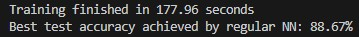
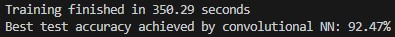

# 🧠 Neural Network vs. CNN Comparison on Fashion-MNIST

This project compares the performance of a traditional Fully Connected Neural Network (NN) and a Convolutional Neural Network (CNN) on the Fashion-MNIST dataset. It serves as a practical demonstration of why CNNs are generally better suited for image classification tasks.

---

## Results: Sample Run



---

## ✨ Features

* **Direct Comparison:** Train and evaluate both an NN and a CNN on the same dataset under similar conditions.
* **Fashion-MNIST Dataset:** Uses the 28x28 grayscale Fashion-MNIST dataset, a slightly more challenging alternative to MNIST.
* **Traditional NN:** Implementation of a basic fully connected neural network.
* **CNN Implementation:** Implementation of a simple CNN with convolutional, batch normalization, pooling, and fully connected layers.
* **Data Preprocessing:** Includes standard image transformations and normalization.
* **Optional Data Augmentation:** The CNN script demonstrates how to apply data augmentation for improved performance.
* **Training and Evaluation:** Standard PyTorch training and evaluation loops for both models.
* **Model Saving:** Saves the best performing weights for each model.

---

## 🚀 Getting Started

### Prerequisites

Make sure you have Python 3.6+ and pip installed. You'll need the following libraries:

* PyTorch (`torch`, `torchvision`, `torchaudio`)

Install them using pip:

```
pip install torch torchvision torchio --index-url https://download.pytorch.org/whl/cpu
```

*(Adjust the PyTorch installation command based on your operating system and whether you have a CUDA-enabled GPU. Refer to the official PyTorch website for details.)*

### Installation

1.  Clone the repository:

```
git clone https://github.com/SakshamVats/nn-cnn-comparison/
cd nn-cnn-comparison
```

2.  (Optional) Create a virtual environment:

```
python -m venv venv
source venv/bin/activate  # On Linux/macOS
venv\Scripts\activate  # On Windows
```

3.  (Optional) Install dependencies using a requirements file if you create one:

```
pip install -r requirements.txt
```

---

## 📊 Usage

You will run each script separately to train and evaluate the respective model. Both scripts will download the Fashion-MNIST dataset to the `data/` folder if it's not present. You may need to change the save path.

1.  **Train and Evaluate the Traditional NN:**

    Run the traditional NN script:

    ```
    python traditional_neural_network.py
    ```

    This script will train the fully connected network, evaluate it on the test set, and save the best model weights to `model/nn_best_model.pth`.

2.  **Train and Evaluate the CNN:**

    Run the CNN script:

    ```
    python convolutional_neural_network.py
    ```

    This script will train the CNN, evaluate it on the test set, and save the best model weights to `model/cnn_best_model.pth`. The CNN script includes optional data augmentation (you can uncomment or modify the augmentation transforms).

Observe the final test accuracy printed by each script to compare their performance.

---

## 📁 Project Structure

```
nn-cnn-comparison/
├── data/                         # Downloaded Fashion-MNIST dataset files
├── model/                        # Directory to save the trained model weights
│   ├── nn_best_model.pth         # Best Traditional NN model
│   └── cnn_best_model.pth        # Best CNN model
├── traditional_neural_network.py # Script for the Traditional NN
├── convolutional_neural_network.py # Script for the CNN
└── README.md                     # This file
```

---

## 🧠 Model Architectures

* **Traditional NN:** A simple feedforward network with a few linear layers and ReLU activations, followed by an output layer. It processes the flattened 28x28 images as a 784-element vector.
* **CNN:** A convolutional neural network designed for 2D image input. It typically consists of convolutional layers (`nn.Conv2d`), Batch Normalization (`nn.BatchNorm2d`), ReLU activations (`F.relu`), and Max Pooling layers (`nn.MaxPool2d`) to extract features while preserving spatial relationships, followed by fully connected layers (`nn.Linear`) for classification.

---

## 📈 Results and Comparison

After running both scripts, you will observe the test accuracy achieved by each model. The CNN is expected to achieve significantly higher accuracy on the Fashion-MNIST dataset compared to the traditional NN.

This difference highlights the CNN's ability to effectively learn from the spatial hierarchy and local patterns in image data, which is lost when images are simply flattened for a traditional fully connected network.

* **Expected Traditional NN Accuracy:** Around 85-89% (depending on hyperparameters and training).
* **Expected CNN Accuracy (without augmentation):** Around 90-92% (depending on architecture and training).
* **Expected CNN Accuracy (with augmentation and more training):** Potentially 92%+ and higher.

---

## 🤝 Contributing

Contributions are welcome! If you find any bugs, have suggestions for improvements, or want to add new features (like visualization of results or training curves), feel free to open an issue or submit a pull request.

---

## 🙏 Acknowledgements

* The Fashion-MNIST dataset creators.
* The PyTorch community and documentation.
  
---
